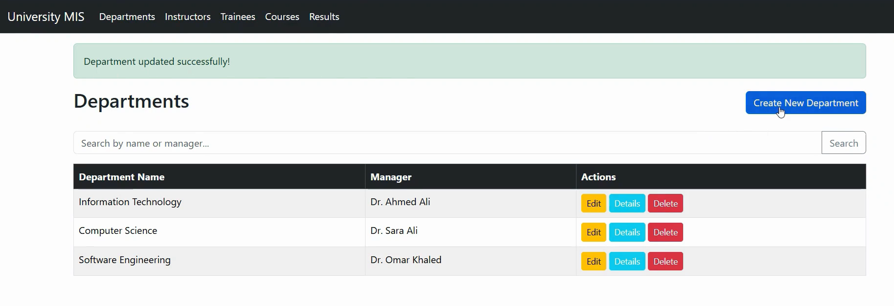
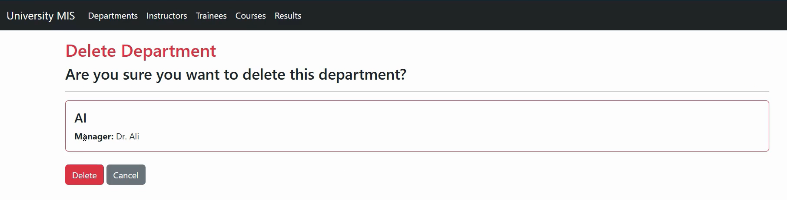
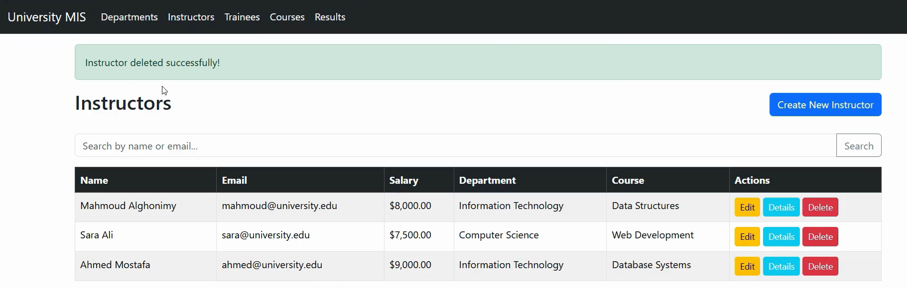
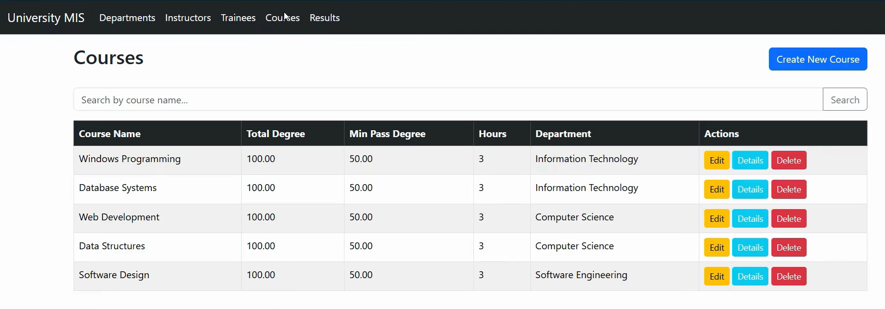

# 🎓 University MIS — Management Information System

<div align="center">


<br/>

> A full-featured **University Management Information System** built with ASP.NET Core MVC 8,  
> implementing complete CRUD operations for Departments, Instructors, Trainees, Courses, and Course Results.

</div>

---

## 📋 Table of Contents

- [Overview](#-overview)
- [Screenshots](#-screenshots)
- [Demo Video](#-demo-video)
- [Features](#-features)
- [Tech Stack](#-tech-stack)
- [Project Structure](#-project-structure)
- [Database Design](#-database-design)
- [Getting Started](#-getting-started)
- [Usage](#-usage)
- [URL Routes](#-url-routes)
- [Author](#-author)

---

## 🌐 Overview

The **University MIS** is a web-based management system that allows university staff to manage academic data across five core entities. It was built as a final project for the **Windows Programming II** course under the supervision of **Dr. Radwa Rady** at Borg El-Arab Technological University.

The system follows the **MVC (Model-View-Controller)** architectural pattern, uses **Entity Framework Core** with Code-First Migrations for database management, and implements a clean, responsive UI using **Bootstrap 5**.

---

## 📸 Screenshots

<div align="center">

### 🏠 Dashboard — Department List


<br/>

### ➕ Delete Form


<br/>

### 🔍 Instructors Page


<br/>

### 📊 Course 


</div>

---

## 🎬 Demo Video

<div align="center">

> Click the link below to watch the full project demo

### 👉 [▶ Watch Demo on Google Drive](https://drive.google.com/file/d/1179kQAUaf2DGQ1VoZqqcs12X5XAf5aYw/view?usp=sharing)

</div>

---

## ✨ Features

### 🏢 Department Management
- View all departments with instructor, trainee, and course counts
- Full CRUD with related-data details page

### 👨‍🏫 Instructor Management
- Search by name or email
- Assign to department and course
- Salary tracking

### 🎓 Trainee Management
- Grade tracking 
- View course results per trainee with Pass/Fail status
- Linked to department

### 📚 Course Management
- Define max degree, min degree, and credit hours
- View assigned instructors and all trainee results
- Department-based filtering

### 📊 Course Results (CrsResult)
- Record trainee grades per course
- Auto-calculated Pass/Fail based on course's minimum degree
- Linked to both trainee and course

### 🔍 Global Search
- Every list page has a live search bar
- Clear button to reset results

### ✅ Validation & UX
- Server-side model validation with inline error messages
- AntiForgery token protection on all POST forms
- Toast notifications for Create / Edit / Delete actions
- "Not Found" page for missing records
- Confirmation page before any deletion

---

## 🛠 Tech Stack

| Layer | Technology |
|---|---|
| Framework | ASP.NET Core MVC 8 |
| Language | C# 12 |
| ORM | Entity Framework Core 8 (Code-First) |
| Database | SQL Server LocalDB (MSSQLLocalDB) |
| UI Framework | Bootstrap 5.3 |
| Icons | Bootstrap Icons 1.11 |
| IDE | Visual Studio 2022 |
| Version Control | Git & GitHub |

---

## 📁 Project Structure

```
UniversityApp/
│
├── Controllers/
│   ├── DepartmentController.cs      # CRUD for departments
│   ├── InstructorController.cs      # CRUD for instructors
│   ├── TraineeController.cs         # CRUD for trainees
│   ├── CourseController.cs          # CRUD for courses
│   └── CrsResultController.cs       # CRUD for course results
│
├── Data/
│   └── AppDbContext.cs              # EF Core DbContext + seed data
│
├── Migrations/
│   └── (auto-generated by EF Core)
│
├── Models/
│   ├── Department.cs                # { Id, Name, Manager }
│   ├── Instructor.cs                # { Id, Name, Email, ImageUrl, Salary, Address, DepartmentId, CrsId }
│   ├── Trainee.cs                   # { Id, Name, ImageUrl, Address, Grade, DepartmentId }
│   ├── Course.cs                    # { Id, Name, Degree, MinDegree, Hrs, DepartmentId }
│   └── CrsResult.cs                 # { Id, Degree, CrsId, TraineeId }
│
├── Views/
│   ├── Department/    → Index, Details, Create, Edit, Delete
│   ├── Instructor/    → Index, Details, Create, Edit, Delete
│   ├── Trainee/       → Index, Details, Create, Edit, Delete
│   ├── Course/        → Index, Details, Create, Edit, Delete
│   ├── CrsResult/     → Index, Details, Create, Edit, Delete
│   ├── Shared/        → _Layout.cshtml, NotFound.cshtml
│   ├── _ViewImports.cshtml
│   └── _ViewStart.cshtml
│
├── assets/                          # Screenshots for README
│   ├── 1.png
│   ├── 2.png
│   ├── 3.png
│   └── 4.png
│
├── appsettings.json                 # Connection string configuration
└── Program.cs                       # App bootstrap & DI registration
```

---

## 🗄 Database Design

### Entity Relationship Diagram

```
Department (1) ──────────────< Instructor (M)
Department (1) ──────────────< Trainee    (M)
Department (1) ──────────────< Course     (M)
Course     (1) ──────────────< Instructor (M)   [optional]
Course     (1) ──────────────< CrsResult  (M)
Trainee    (1) ──────────────< CrsResult  (M)
```

### Relationships Summary

| Relationship | Type | On Delete |
|---|---|---|
| Department → Instructor | One-to-Many | Restrict |
| Department → Trainee | One-to-Many | Restrict |
| Department → Course | One-to-Many | Restrict |
| Course → Instructor | One-to-Many (optional) | Set Null |
| Course → CrsResult | One-to-Many | Cascade |
| Trainee → CrsResult | One-to-Many | Cascade |

---

## 🚀 Getting Started

### Prerequisites

- [Visual Studio 2022](https://visualstudio.microsoft.com/) (with ASP.NET workload)
- [.NET 8 SDK](https://dotnet.microsoft.com/download/dotnet/8.0)
- [SQL Server Express / LocalDB](https://www.microsoft.com/en-us/sql-server/sql-server-downloads)

### Installation

**1. Clone the repository**

```bash
git clone https://github.com/alghonimy/wp-ii-final-practical-project
cd wp-ii-final-practical-project
```

**2. Open in Visual Studio**

Double-click `UniversityApp.sln` or open it from Visual Studio.

**3. Install NuGet Packages**

In **Package Manager Console** (`Tools → NuGet Package Manager → Package Manager Console`):

```bash
Install-Package Microsoft.EntityFrameworkCore.SqlServer
Install-Package Microsoft.EntityFrameworkCore.Tools
Install-Package Microsoft.EntityFrameworkCore.Design
```

**4. Apply Database Migrations**

In **Package Manager Console**:

```bash
Add-Migration InitialCreate
Update-Database
```

This creates the database at `(localdb)\MSSQLLocalDB` with all tables and seed data.

**5. Run the application**

Press **F5** or click the **Run** button. The browser will open at `/Department`.

---

## 💡 Usage

After running the app, you can:

- **Browse** all entities from the sidebar navigation
- **Search** any list by typing in the search bar
- **Add** new records using the `+ Add` button on each list page
- **View** full details by clicking the 👁 eye icon
- **Edit** any record by clicking the ✏️ pencil icon
- **Delete** any record (with confirmation) by clicking the 🗑 trash icon

---

## 🗺 URL Routes

| URL | Method | Action |
|---|---|---|
| `/Department` | GET | List all departments |
| `/Department/Details/{id}` | GET | View department details |
| `/Department/Create` | GET / POST | Create new department |
| `/Department/Edit/{id}` | GET / POST | Edit department |
| `/Department/Delete/{id}` | GET / POST | Delete department |
| `/Instructor` | GET | List all instructors |
| `/Instructor/Create` | GET / POST | Create new instructor |
| `/Trainee` | GET | List all trainees |
| `/Trainee/Create` | GET / POST | Create new trainee |
| `/Course` | GET | List all courses |
| `/Course/Create` | GET / POST | Create new course |
| `/CrsResult` | GET | List all course results |
| `/CrsResult/Create` | GET / POST | Record new result |

> All entities follow the same RESTful pattern:  
> `/{Entity}` → `/{Entity}/Details/{id}` → `/{Entity}/Create` → `/{Entity}/Edit/{id}` → `/{Entity}/Delete/{id}`

---

## 👨‍💻 Author

<div align="center">

| | |
|---|---|
| **Name** | Mahmoud Alghonimy Abdalhamed Attia |
| **ID** | 2220430 |
| **Department** | Software Development |
| **University** | Borg El-Arab Technological University |
| **Supervisor** | Dr. Radwa Rady |
| **Course** | Windows Programming II |
| **Semester** | 2nd Term 2025/2026 |
| **🎬 Demo Video** | [Watch on Google Drive](https://drive.google.com/file/d/1179kQAUaf2DGQ1VoZqqcs12X5XAf5aYw/view?usp=sharing) |
| **💻 GitHub** | [github.com/alghonimy/wp-ii-final-practical-project](https://github.com/alghonimy/wp-ii-final-practical-project) |

</div>

---

## 📄 License

This project was created for academic purposes as part of the Windows Programming II course.

---

<div align="center">
  Made with ❤️ using ASP.NET Core MVC 8
</div>
